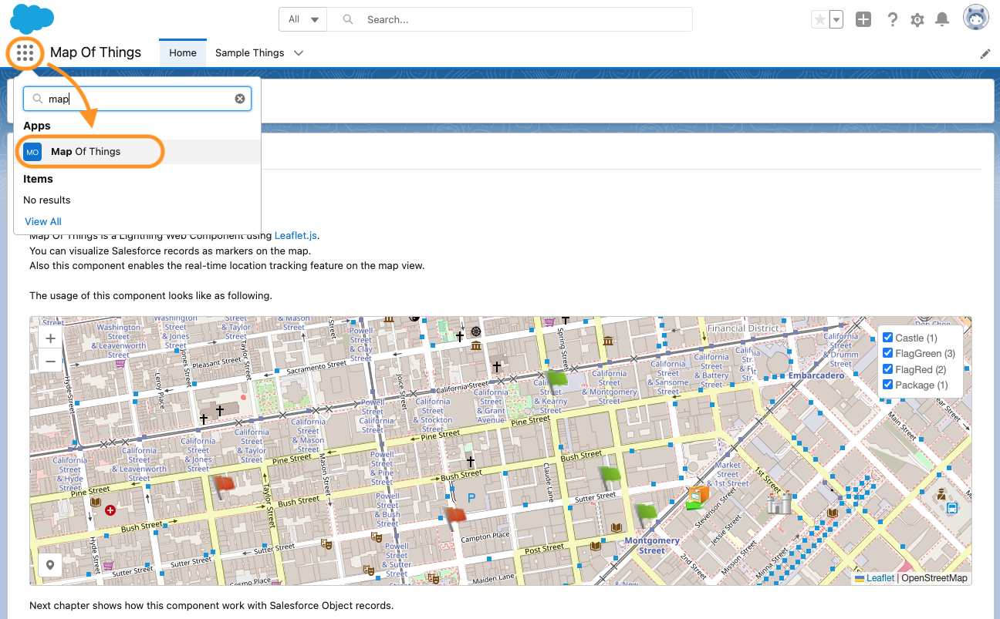

# Map Of Things - LWC

## Installation

1. Set up enviroment. Follow the steps in the https://trailhead.salesforce.com/content/learn/projects/quick-start-lightning-web-components/

2. Authenticate with your DevHub Org.
```
sfdx force:auth:web:login -d -a [YOUR DEV HUB ORG ALIAS]
```

3. Clone the Map Of Things repository
```
git clone https://github.com/SalesforceLabs/Map-Of-Things.git
```

4. Move to the directory
```
cd Map-Of-Things/
```

5. Create a scratch org
```
sfdx force:org:create -s -f config/project-scratch-def.json -a map-of-things-scratch
```

6. Push source code to the scratch org
```
sfdx force:source:push -u map-of-things-scratch
```

7. Assign the permission set to the default user
```
sfdx force:user:permset:assign -n Map_Of_Things_Manager -u map-of-things-scratch
```
8. Load sample records
```
sfdx force:apex:execute -u map-of-things-scratch -f loadSampleRecords.apex
```
9. Open scratch org
```
sfdx force:org:open -u map-of-things-scratch
```
10. Click application launcher, select "Map Of Things" Application
